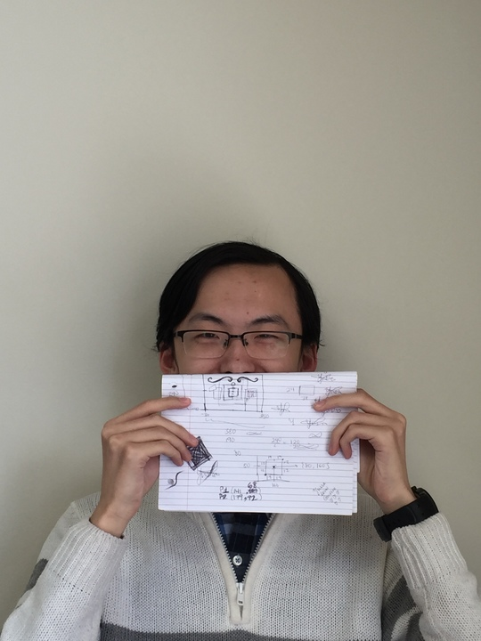
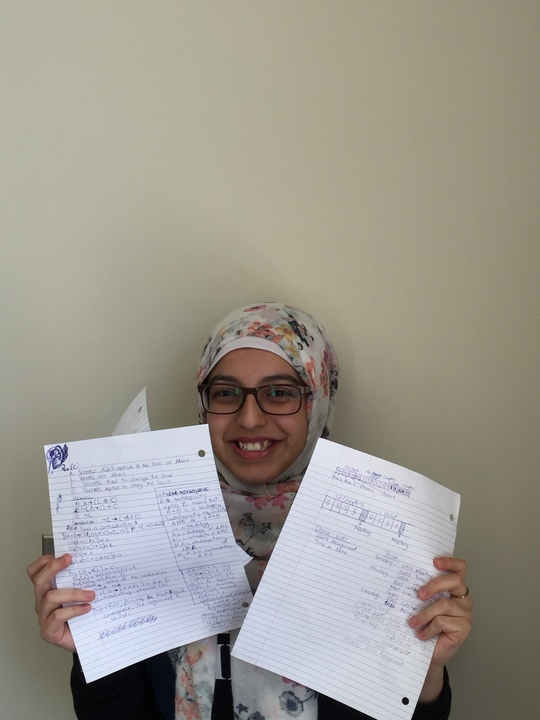
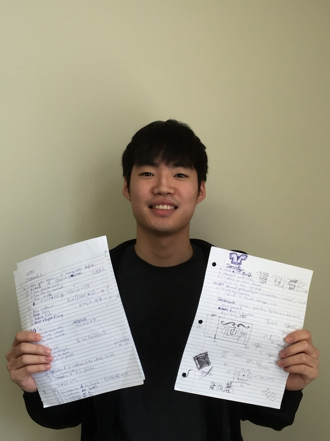
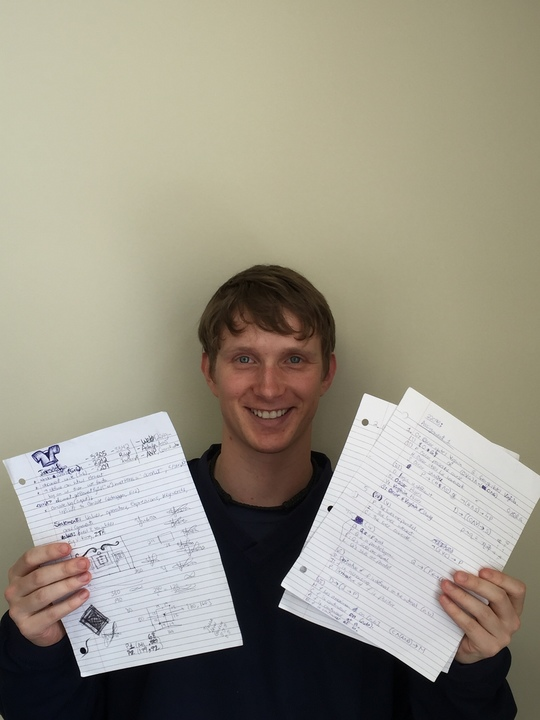
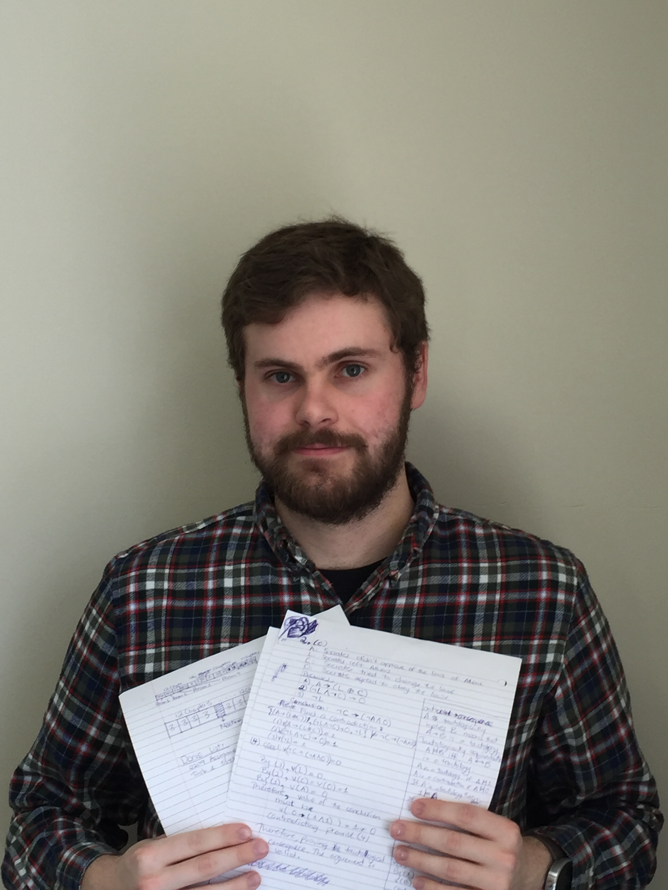
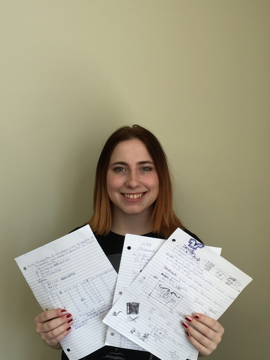
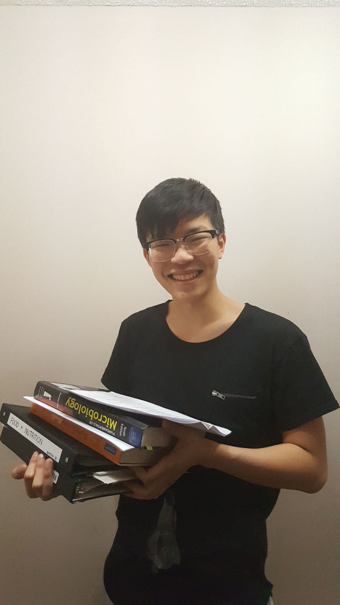
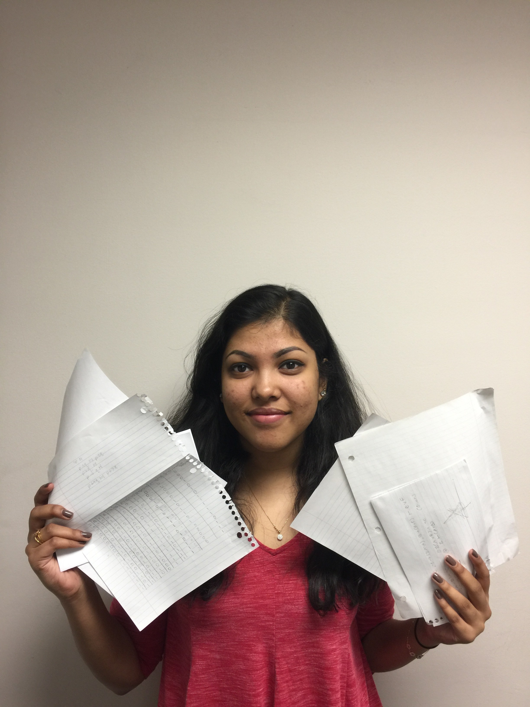

# Roster Page

## Introducing Ethan's Angels
Get to know Ethan's Angels.

### Yu Guo

Chief Executive for Ethan's Angels ltd., taking care of general management. Also Asian for some reason. Enjoy doing fun stuff, hopefully able to do more in this project. Life is short, play hard. Also my name is actually pronounced Mi.

### Yusra Al-Sharafi

Hi! My name is Yusra. I'm currently in my third year pursuing a degree in Computer Science. I am familiar with Java, C, JavaScript, HTML, and ARM, with ARM being my least favorite. Apart from being passionate about Computer Science, I am also passionate about art (all forms of expression), student advocacy, and politics. Everything I do, and will be doing in the future, will revolve around everything tech and giving back to the community.

### Justin Kim

Hi, my name is Justin Kim and I am from London, Ontario. I am a third year student pursuing a degree in Computer Science. I am experienced in Java and am familiarizing myself with other languages outside of school.

### Gabe Keenleyside

Gabe Keenleyside. Comp sci/physics student. Avid Sriracha sauce user. Can balance on both feet, both one at a time and together.

### Cameron Nicolle

My name is Cameron Nicolle I'm from London. I'm a second year computer science student. I have experience in C, C++, Java, Python and web development. I have a particular interest in operating system, web development development.

### Emma Henriksen-Willis

I'm from Ottawa and I'm experienced in Java, C, and Python, with a particular interest in artificial intelligence. I'm planning on pursuing a minor in either software engineering or anthropology as well as my CS specialization.

### Paul Li

I’m Paul Li, a jack-of-all trades when it comes to programming. Currently in my second year majoring in CS. I was born and raised in Mississauga Ontario with two older brothers who currently work for Amazon and Google. Along with my intentions in joining them later in the future, I also have quite a few hobbies. Some of my favorite include video games, board games, longboarding and browsing /r/me_irl. My responsibility is to work on the frontend to help provide elegant code from a seamless interaction between the user and the interface and with easy to read code for my fellow peers. Someone I look up to the most is Elon Musk, a risk taker, innovator and a massive impact on today’s modern technology.

"Failure is an option here. If things are not failing, you are not innovating enough." – Elon Musk

### Priya Kumaresan

Hi my name is Priya Kumaresan! I’m currently in the second year of my program and I’m hoping to specialize in Computer Science. As for my skills, I have previously programmed in Python, Java, and C and I’m currently learning JavaScript, Ruby, and Haskell. I have also learned to use Unix operating system. I love to play badminton, dance, and bake!
