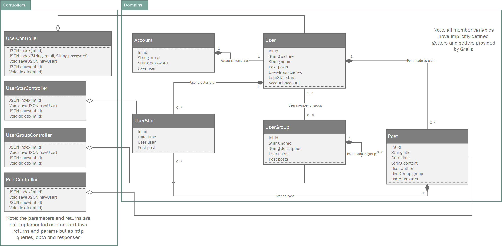
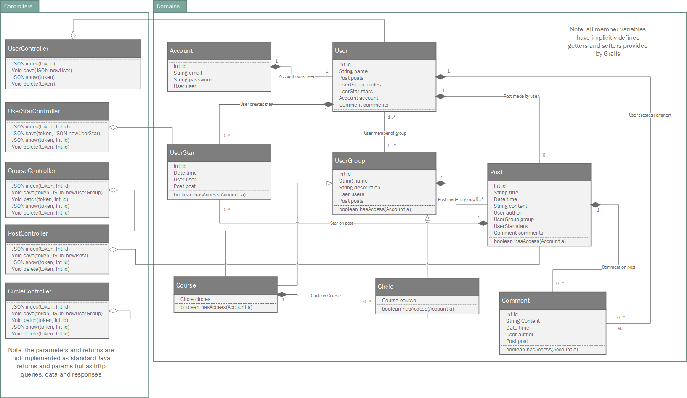

# Software Design

A description of the design of the software.

---

## UML Diagrams

### Domains

### Controllers

## Stage 2

The current state of the software in stage 2

## Stage 3

The current state of the software in stage 3

