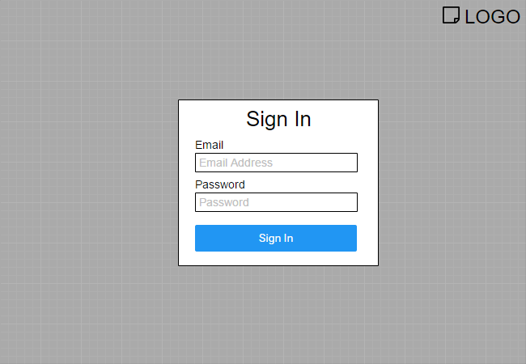

# UI Design
 
The look and feel for our web app is aimmed towards a simple and user friendly interface for everyone. The design principle we decided to follow is a flat design that will follow the guidelines stated by [Designmodo](https://designmodo.com/flat-design-principles/). With the focus on simple elements and colour to help make an elegant website to stand out above the rest.

 
 
 

## Welcome Page

This will be the first page users will see when they visit our website for the first time or when the user hasn't logged in. This page is a simple page prompting them to login with an existing account or sign up for a new account. 

<a href="#" >Back To Top</a>

---

## Home Page

This will be the hompage or the central hub of our website. Under "My Circles", users will be able to see all of his or her groups (circles) that they are currently in .  Certain circles would be highlighted indicating that they their is new or unchecked content for the user (as shown in cs3305 and cs3340). 

On the right side "Circle News" is for displaying a more indepth detail about new posts, comments and etc about the current user's circles. Here the user would also be able to filter his or her news to their likings. 

On the top of the page in the center would display alerts to grab the users attention. This would be used to display urgent messages the user would need to check out as soon as possible. For the top left it would lead to a dropdown menu to navigate through other places on the website (refer to the image below). 

<a href="#" >Back To Top</a>

---

## Register

Here, the user will have to use an university email to help authenticate the user and a profile picture for their account. 

After the user created the account the website has to wait for the authentication. 

<a href="#" >Back To Top</a>

---

## Login Page

Uses the email that you registered and the password associated with the account that was created to login. 

<a href="#" >Back To Top</a>

---

## Inbox Page

Here you will be able to see certain messages regarding access to certain sub-circles and other imporant information that needs to relayed to the user. There is also a read and unread section to help organize the users inbox messages. 

<a href="#" >Back To Top</a>

---

## Class Page

Here will display information about a specific class and under "Notes" it will display all the notes currently associated with the class. It will display information such as the title and the author of the post. There will be also a create new post for users to upload their own content. Clicking on the posts would lead to viewing the actual content of the notes and more (see Document view page).

Under "Sub-Circles" it will be used to display all the circles within the user's class (CS2212). Here they would also be able to subscribe to certain circles or create their own. 

"News" would contain content that is new or unchecked by the user in the specific class and the sub-circles the user is following. 

<a href="#" >Back To Top</a>

---

## Document View Page

The user will be able to view the contents of the note in the left box and in the right box it will contain user comments regarding the notes. There will be also ratings for the user to score out of 5 stars. A download button is included for the user to download locally to their computer to view and edit. 

<a href="#" >Back To Top</a>

---

## Create Post Page

Here, you can set the title and upload the files that you wish to post to the class indicated at the top. 

<a href="#" >Back To Top</a>

---

## Create Circle Page

Here, you can set the title and add specific users by email to the sub-circle of the class indicated at the top. 

<a href="#" >Back To Top</a>

